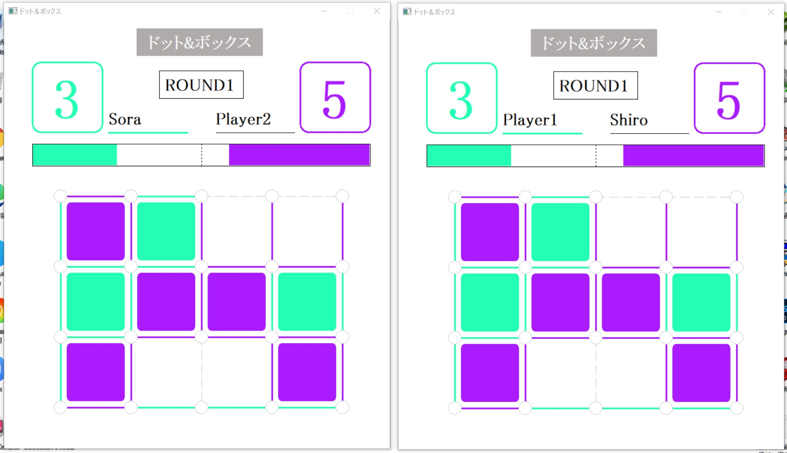

# dots-and-boxes
Windows向けの2人遠隔対戦ができるドット&ボックスというゲームのプログラムになります．

## フォルダ構成
```
dots-and-boxes/
├── dots-and-boxes.cpp   # ゲームのプログラム
├── screenshots/         # 各画面のスクリーンショット
└── README.md
```

## ゲーム画面

